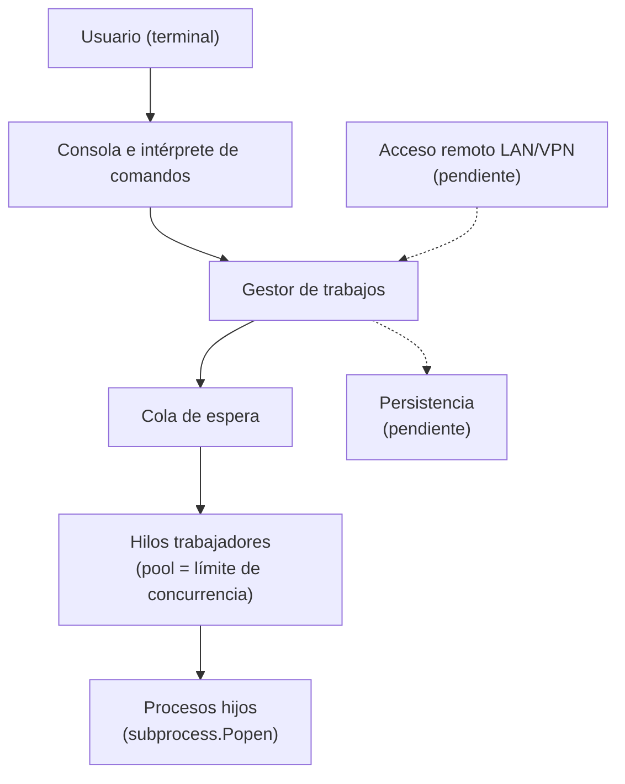

<p align="center">
  
</p>
 
*Proyecto de Qiskit Team*
 
## 🎯 Propósito
 
Desarrollaremos **Q-umplidor**, que funcionará como un gestor de trabajos para Linux, capaz de recibir, ejecutar, supervisar y administrar procesos.
 
## 👥 Integrantes

| Nombre | Rol | Correo |
|--------|-----|--------|
| Oscar Omar Aguilera De La Torre | Responsable principal | oscar.aguilera7936@alumnos.udg.mx |
| Marlene Ximena Sandoval Garcia | Ingeniería | marlene.sandoval5114@alumnos.udg.mx |
| Ruy Eleazar Valle Rojas | Verificación | ruy.valle6299@alumnos.udg.mx |
| Diego Misael Camacho Nuño | Revisor de producto | diego.camacho8526@alumnos.udg.mx |

## 🏗️ Construcción provisional

### Tecnologías y entorno
> El proyecto se encuentra en una etapa inicial; aún no tenemos definido con certeza el lenguaje que utilizaremos, pero de manera provisional será Python.
- **Python 3:** lenguaje propuesto para el desarrollo.
- **Linux:** sistema operativo.

### 📁 Estructura del proyecto

```text
Q-umplidor/
├── README.md                    # Visión, construcción, ejecución y prueba.
├── src/                         # Código de producción.
├── docs/
│   ├── user-guide/              # Instalación y operación.
│   ├── technical-guide/         # Arquitectura, protocolo, persistencia y decisiones.
│   ├── decisions/               # Decisiones de arquitectura — ADR.
│   ├── ai-usage/                # Registro del uso de IA.
│   ├── change-requests/         # Cambios del cliente y análisis de impacto.
│   └── incidents/               # Síntomas, evidencia, hipótesis, causa, corrección y regresión.
├── verif/
│   ├── verification-plan/       # Plan y matriz de trazabilidad.
│   ├── test-cases/              # Casos TC-XXX.
│   ├── scripts/                 # Automatización.
│   ├── test-data/               # Datos controlados.
│   └── results/                 # Evidencia por ejecución.
├── project-management/          # Planificación, roles, minutas, acuerdos y evidencia.
└── .github/
    └── ISSUE_TEMPLATE/          # Plantillas de trabajo y defectos.
```


### 💻 Preparación y ejecución

Clonar el repositorio y entrar a su carpeta:

```bash
git clone https://github.com/Maliboo127/Q-umplidor.git
cd Q-Cumplidor
```

Ejecutar el programa:

```bash
python3 src/main.py
```

### ⌨️ Comandos disponibles
| Comando | Qué hace |
|---|---|
| `sleep N &` | Envía un trabajo en segundo plano y devuelve su ID |
| `estado <id>` | Informa si el trabajo está en ejecución o terminó |
| `listar` | Muestra los trabajos enviados |
| `codigo <id>` | Informa el código de salida de un trabajo terminado |


## Arquitectura inicial (preliminar)

Q-umplidor es una aplicación en capas, escrita en Python 3 con la biblioteca estándar. La consola recibe los comandos, un gestor de trabajos los registra y aplica el límite de concurrencia, y un pool de hilos lanza cada trabajo como un proceso independiente del sistema operativo.



*Las líneas discontinuas indican componentes pendientes.*

Detalle completo en la [guía de arquitectura](docs/technical-guide/arquitectura.md). Decisiones relacionadas:
[ADR-0001](docs/decisions/0001-lenguaje-runtime.md) (lenguaje),
[ADR-0002](docs/decisions/0002-modelo-concurrencia.md) (concurrencia) y
[ADR-0003](docs/decisions/0003-persistencia.md) (persistencia, abierta).

## Modelo preliminar de estados

Un trabajo pasa por los siguientes estados, y los finales no tienen regreso:

| Estado | Significado |
|---|---|
| `QUEUED` | Espera turno porque se alcanzó el límite de concurrencia |
| `RUNNING` | Se está ejecutando como proceso hijo |
| `FINISHED` | Terminó correctamente (código de salida `0`) |
| `FAILED` | Terminó con error (código `1` a `255`) |
| `CANCELLED` | Se canceló en cola o durante la ejecución |
| `INTERRUPTED` | Estaba pendiente cuando el servicio se reinició (pendiente de implementar) |

*Los nombres distintos de `QUEUED` y `RUNNING` son preliminares.* Transiciones, reglas y diagrama en el [modelo de estados](docs/technical-guide/ModeloDeEstados.md).

### 🔹 Planeación


El proyecto se construirá por etapas. Primero se hará que el sistema
pueda ejecutar, consultar y cancelar trabajos de forma local.

Después, se le agregará la capacidad de manejar varios trabajos al
mismo tiempo, guardar sus resultados y recuperarse si el sistema se
reinicia o falla.

Por último, se agregará el acceso remoto, para que el sistema pueda
usarse desde otros equipos dentro de una red privada o VPN. El código
y la documentación se irán actualizando conforme se avance en cada
etapa.

### 🔸 Verificación prevista

A lo largo de las distintas etapas del proyecto se realizarán pruebas
para verificar que el sistema se comporta como se espera, tanto en
condiciones normales como ante situaciones de falla o alta demanda.

Cada prueba realizada, junto con su resultado, se documentará como
evidencia dentro del repositorio, de forma que sea posible dar
seguimiento al cumplimiento de los requisitos a lo largo del tiempo.
Los defectos que se identifiquen se registrarán y corregirán antes de
avanzar a la siguiente etapa.
 
## 📊 Estado del proyecto
 
Nos encontramos en la etapa inicial de planificación y análisis. Estamos organizando los roles del equipo, preparando el repositorio y definiendo los requerimientos, el lenguaje y la estructura general. Una vez finalizada esta fase, daremos inicio al desarrollo del proyecto.
 
