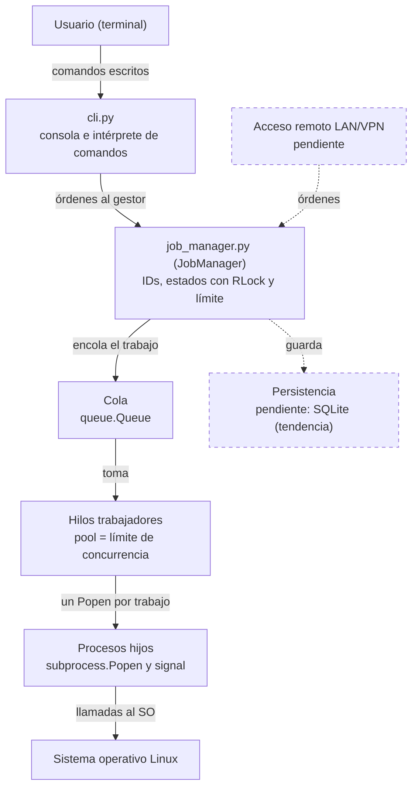

# Arquitectura inicial de Q-umplidor

> **Estado del documento:** versión preliminar. Describe lo implementado en el prototipo local y lo que aún está pendiente. Si una decisión escrita en un ADR difiere de este documento, el ADR prevalece.

## 1. Propósito

***Q-umplidor*** es un sistema para Linux que ejecuta, administra, observa y controla trabajos mediante una consola interactiva. Este documento describe cómo está organizado: qué componentes tiene, cómo se comunican y qué decisiones sostienen el diseño.

## 2. Estilo arquitectónico

Aplicación **en capas** escrita en Python 3, con la biblioteca estándar. Cada capa solo se comunica con la inmediata inferior:

1. **Interfaz:** recibe comandos del usuario y muestra respuestas.
2. **Lógica de trabajos:** asigna identificadores, controla estados y aplica el límite de concurrencia.
3. **Ejecución:** lanza cada trabajo como un proceso independiente del sistema operativo.

La concurrencia real la aportan los **procesos hijos** del sistema operativo. Los hilos de Python solo supervisan esos procesos, por lo que el GIL no limita la ejecución en paralelo de los trabajos.

## 3. Diagrama

*Las líneas y bordes discontinuos indican componentes pendientes.*

## 4. Componentes

| Componente | Archivo o biblioteca | Responsabilidad | Estado |
|---|---|---|---|
| Arranque | `src/main.py` | Punto de entrada: inicia la consola | Implementado |
| Consola e intérprete | `src/cli.py` | Muestra el prompt `Q-umplidor>`, interpreta los comandos (`sleep`, `estado`, `listar`, `codigo`, `cancelar`) e imprime las respuestas | Implementado |
| Gestor de trabajos | `src/job_manager.py` (clase `JobManager`) | Asigna IDs únicos, mantiene la tabla de estados, aplica el límite de concurrencia y captura stdout y stderr por separado | Implementado |
| Cola de espera | `queue.Queue` | Guarda los trabajos que esperan turno | Implementado |
| Hilos trabajadores | `threading` (`_worker_loop`) | Pool fijo, de tamaño igual al límite de concurrencia, que toma trabajos de la cola y los lanza | Implementado |
| Procesos hijos | `subprocess.Popen`, `signal` | Ejecutan cada trabajo como proceso separado y permiten cancelarlo | Implementado |
| Persistencia | Por definir (tendencia: SQLite) | Conservar el historial y recuperarlo tras un reinicio | Pendiente |
| Acceso remoto LAN/VPN | Por definir | Recibir órdenes de otros equipos y entregarlas al mismo `JobManager` | Pendiente |

## 5. Flujos principales

### 5.1 Enviar un trabajo en segundo plano (`sleep 10 &`)

1. `cli.py` recibe el texto y lo interpreta como un envío en segundo plano.
2. `JobManager` asigna un ID único, registra el trabajo y lo coloca en la cola.
3. Un hilo trabajador toma el trabajo y lo lanza con `subprocess.Popen`.
4. La consola imprime el ID y vuelve a mostrar el prompt, mientras el trabajo corre por separado.

### 5.2 Consultar el estado o el código de salida (`estado <id>`, `codigo <id>`)

1. `cli.py` valida el formato del comando y el ID.
2. `JobManager` busca el trabajo en la tabla de estados.
3. Si el proceso ya terminó, se informa su estado y su código de salida. Si sigue en ejecución, se informa que aún no tiene código.

### 5.3 Cancelar un trabajo (`cancelar <id>`)

1. Si el trabajo está **en cola**, se retira y se marca como cancelado.
2. Si está **en ejecución**, se envía una señal al proceso hijo y se marca como cancelado.

## 6. Concurrencia y sincronización

- **Límite estructural:** nunca existen más hilos trabajadores que el límite de concurrencia configurado, por lo que no se ejecutan más trabajos simultáneos que ese límite.
- **Estado compartido:** la cola y la tabla de estados son accedidas por quien recibe las órdenes y por los hilos trabajadores. Se protegen con un `threading.RLock`.
- **Verificación:** la prueba `test_respects_concurrency_limit` lanza 4 trabajos con límite 2 y comprueba que nunca haya más de 2 en ejecución. Las pruebas `test_cancel_queued_job` y `test_cancel_running_job` validan la cancelación y su sincronización.

## 7. Decisiones de diseño relacionadas

| ADR | Decisión | Estado |
|---|---|---|
| [ADR-0001](docs/decisions/0001-lenguaje-runtime.md) | Python 3 con biblioteca estándar (`subprocess`, `threading`, `queue`, `signal`) | Aceptado |
| [ADR-0002](docs/decisions/0002-modelo-concurrencia.md) | Pool fijo de hilos trabajadores sobre una `queue.Queue` compartida, un `Popen` por trabajo | Aceptado |
| [ADR-0003](docs/decisions/0003-persistencia.md) | Mecanismo de persistencia (tendencia: SQLite) | Propuesta abierta |

## 8. Pendientes y riesgos

| Tema | Descripción |
|---|---|
| Persistencia | Resolver el ADR-0003 antes del Hito 2. Con SQLite, cada hilo debe usar su propia conexión o protegerla con el `RLock`, porque una conexión solo se puede usar desde el hilo que la creó |
| Recuperación | Al reiniciar, los trabajos que estaban en cola o en ejecución deben marcarse como interrumpidos y nunca reportarse como en ejecución (ver [modelo de estados](modelo-de-estados.md)) |
| Acceso remoto | Definir el protocolo de red, la forma de autenticar y cómo comparte el `JobManager` con la consola local |
| Cola llena | Documentar el comportamiento del sistema cuando se alcanza el límite de la cola |

## 9. Requisitos relacionados

RF-03, RF-04, RF-05, RF-12, RF-13, RF-25, RF-26, RNF-04, RNF-07, RNF-27.
