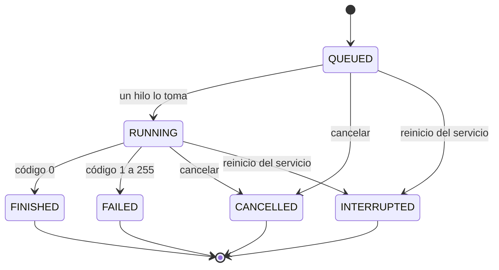

# Modelo preliminar de estados de un trabajo

> **Estado del documento:** versión preliminar. `QUEUED` y `RUNNING` provienen de los ADR; los demás nombres son propuestos y deben confirmarse contra `src/job_manager.py`.

## 1. Propósito

Definir en qué estados puede encontrarse un trabajo desde que se envía hasta que termina, y qué eventos provocan cada cambio. Este modelo sirve de base para el comportamiento de `estado`, `listar`, `codigo` y `cancelar`, y para la recuperación tras un reinicio.

## 2. Estados

| Estado | Significado | Cómo se llega | Código de salida |
|---|---|---|---|
| `QUEUED` | El trabajo espera turno porque se alcanzó el límite de concurrencia | Se envía un trabajo | No tiene |
| `RUNNING` | Un hilo trabajador lo lanzó como proceso hijo | Un hilo lo toma de la cola | No tiene |
| `FINISHED` | Terminó correctamente | El proceso termina | `0` |
| `FAILED` | Terminó con error | El proceso termina | `1` a `255` |
| `CANCELLED` | Se canceló antes o durante la ejecución | Comando `cancelar` | Si ya se ejecutaba, un código negativo (por ejemplo `-15`) |
| `INTERRUPTED` | Estaba en cola o en ejecución cuando el servicio se reinició | Recuperación al arrancar | No tiene |

## 3. Diagrama

## 4. Transiciones

| De | A | Evento | Condición |
|---|---|---|---|
| (inicio) | `QUEUED` | Envío de un trabajo | El comando es válido |
| `QUEUED` | `RUNNING` | Un hilo trabajador toma el trabajo | Hay un hilo libre (la cantidad de trabajos en ejecución es menor que el límite) |
| `RUNNING` | `FINISHED` | El proceso termina | Código de salida `0` |
| `RUNNING` | `FAILED` | El proceso termina | Código de salida entre `1` y `255` |
| `QUEUED` | `CANCELLED` | Comando `cancelar` | El trabajo aún no se lanzó |
| `RUNNING` | `CANCELLED` | Comando `cancelar` | Se envía una señal de terminación al proceso |
| `QUEUED`, `RUNNING` | `INTERRUPTED` | Reinicio del servicio | Al arrancar se recupera el historial y se encuentran trabajos sin terminar |

## 5. Reglas del modelo

1. Un trabajo solo avanza: no hay transiciones de regreso.
2. `FINISHED`, `FAILED`, `CANCELLED` e `INTERRUPTED` son **estados finales**.
3. La cancelación es el único evento que puede ocurrir desde `QUEUED` y desde `RUNNING`.
4. El código de salida solo existe si el proceso llegó a ejecutarse y terminó. Es lo que informa el comando `codigo`; un trabajo en `QUEUED` o `RUNNING` informa que aún no tiene código.
5. Un trabajo nunca debe reportarse como `RUNNING` si su proceso ya no existe.

## 6. Relación con el código de salida

| Código | Interpretación | Estado resultante |
|---|---|---|
| `0` | Éxito | `FINISHED` |
| `1` a `255` | Error del sistema | `FAILED` |
| Negativo, producido por la cancelación del sistema (por ejemplo `-15`, señal SIGTERM) | Terminado por señal | `CANCELLED` |

*Por definir:* el estado de un trabajo terminado por una señal que no provino de `cancelar` (por ejemplo, un `kill` externo).

## 7. Relación con la persistencia y la recuperación

Al reiniciar el servicio, los procesos hijos de la ejecución anterior ya no existen. Por eso, al recuperar el historial (RF-13), todo trabajo que estaba en `QUEUED` o `RUNNING` se marca como `INTERRUPTED`, y nunca se reporta como en ejecución. Esta regla se verificará con la prueba de reinicio del servicio (TC-007), pendiente de la decisión del [ADR-0003](../decisions/0003-persistencia.md).

## 8. Pendientes

- Confirmar los nombres exactos de los estados en `src/job_manager.py` y ajustar este documento.
- Decidir si `FAILED` es un estado separado o si se informa solo mediante el código de salida.
- Definir el tratamiento de un trabajo terminado por una señal externa.
- Implementar `INTERRUPTED` junto con la persistencia.
