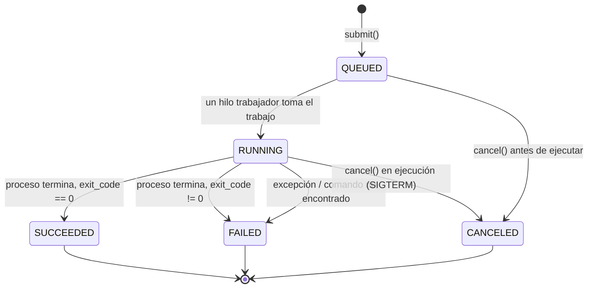

# Modelo preliminar de estados — Q-umplidor

## Diagrama de transiciones

## Estados (RF-06)

| Estado | Significado | ¿Es terminal? |
|---|---|---|
| `QUEUED` | El trabajo fue aceptado y está esperando un hilo trabajador libre. | No |
| `RUNNING` | Un hilo trabajador lanzó el proceso hijo y está esperando a que termine. | No |
| `SUCCEEDED` | El proceso terminó con código de salida `0`. | Sí |
| `FAILED` | El proceso terminó con código de salida distinto de `0`, o no pudo lanzarse (comando inválido) o lanzó una excepción inesperada. | Sí |
| `CANCELED` | Se solicitó la cancelación mientras estaba en `QUEUED` o `RUNNING`. | Sí |

## Reglas de transición

- Un trabajo **solo puede tener un estado a la vez** (invariante protegido
  por `threading.RLock` en `JobManager`, ver `docs/technical-guide/architecture.md`).
- **No existen transiciones hacia atrás.** Una vez en un estado terminal
  (`SUCCEEDED`, `FAILED`, `CANCELED`), el trabajo no puede volver a
  `QUEUED` ni `RUNNING` (RNF-27 — sin regresiones de estado).
- **Cancelar un trabajo ya terminado es una operación idempotente**: si
  `cancel()` se llama sobre un trabajo en estado terminal, simplemente
  devuelve su estado actual sin error y sin cambiarlo (semántica prevista
  para RF-26, cancelaciones concurrentes/duplicadas).
- Un trabajo cancelado **mientras estaba en `QUEUED`** nunca llega a
  ejecutarse: se marca `CANCELED` directamente, sin pasar por `RUNNING`.

## Campos registrados por trabajo (RF-07)

| Campo | Se llena en... |
|---|---|
| `submitted_at` | Al crear el trabajo (`submit()`) |
| `started_at` | Al pasar a `RUNNING` |
| `finished_at` | Al llegar a cualquier estado terminal |
| `exit_code` | Al terminar el proceso normalmente (`None` si nunca llegó a ejecutarse) |
| `error` | Solo si hubo una falla al lanzar/ejecutar el proceso |

## Pendiente para próximos hitos

- Persistencia de este modelo entre reinicios del servicio (RF-12, RF-13,
  RNF-10) — Hito 2.
- Estado adicional o sub-estado para diferenciar "cancelación solicitada,
  esperando confirmación del SO" vs. "cancelación confirmada", si se agrega
  una política de escalamiento con `SIGKILL` (RF-30) — Hito 2.
