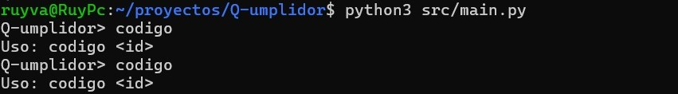
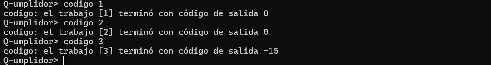

# Evidencia de verificación: versión 01, código de salida (RF-07)

## 1. Identificación de la versión

| Campo | Valor |
|---|---|
| *Producto* | Q-umplidor |
| *Requisito verificado* | RF-07: obtener el código de salida de un trabajo |
| *Versión* | Versión 01 (Avance 01) |
| *Commit evaluado* | `66c4153` |
| *Fecha de la demostración* | 02/10/2026 |
| *Responsable de la ejecución* | Ruy |
| *Revisores* | Marlene, Diego Misael |

## 2. Entorno de ejecución

| Campo | Valor |
|---|---|
| Sistema operativo | Linux |
| Versión de Python | Python 3.13.1 |
| Comando de arranque | `python3 src/main.py`|

## 3. Alcance de la demostración

**Funcionalidad incluida en esta versión:** comando `codigo <id>`, que informa el código de salida de un trabajo ya enviado.

**Comportamientos verificados en este documento:**

- Uso incorrecto del comando (sin ID).
- Trabajo terminado correctamente (código `0`).
- Trabajo terminado por una señal (código negativo).

**No se verifican en este documento:** la consulta de un trabajo que aún está en ejecución, un trabajo que termine con código positivo, ni el envío, la consulta de estado, el listado y la cancelación de trabajos.

## 4. Interpretación del código de salida

El código de salida es un número que un proceso entrega al sistema operativo cuando termina e indica cómo terminó. El comando `codigo <id>` lo informa para los trabajos que ya finalizaron.

**Criterio de la verificación:** si la salida es `0`, la ejecución fue exitosa; si está entre `1` y `255`, se considera un error del sistema.

| Código | Significado | Interpretación |
|---|---|---|
| `0` | Éxito | El trabajo terminó correctamente |
| `1` a `255` | Error del sistema | El trabajo terminó con un error que el sistema registra mediante este código. El valor concreto lo define el programa que se ejecutó; por convención, `1` indica un error general y los demás valores identifican fallas específicas |
| Negativo (por ejemplo `-15`) | Terminado por señal | El trabajo no terminó por sí mismo: una señal del sistema lo interrumpió. En Linux, `-15` corresponde a SIGTERM, la solicitud estándar de terminación (por ejemplo, al cancelar un trabajo) |

Un trabajo que todavía está en ejecución no tiene código de salida. En ese caso el comando solo informa que sigue en ejecución y no muestra ningún número.

**Ejemplos de esta evidencia:** los trabajos 1 y 2 terminaron con `0` (éxito) y el trabajo 3 con `-15` (terminado por señal).

## 5. Casos ejecutados

### TC-001: Comando sin ID

| Campo | Contenido |
|---|---|
| **Objetivo** | Verificar que el comando `codigo` escrito sin ID no falla y muestra cómo se usa |
| **Precondiciones** | Consola iniciada |
| **Pasos** | 1. Escribir `codigo` y presionar Enter. |
| **Resultado esperado** | La consola imprime exactamente: `Uso: codigo <id>` |
| **Resultado obtenido** | Se envió el comando `codigo` incompleto y la consola mostró el mensaje de uso: `codigo <id>`. Coincide con lo esperado. |
| **Estado** | ✅ Aprobado |

### Casos TC-002 a TC-004: código de salida de trabajos terminados

Los tres casos siguientes se ejecutaron en una misma sesión de la consola. La captura muestra las tres consultas, una por caso:

### TC-002: Trabajo terminado correctamente (ID 1)

| Campo | Contenido |
|---|---|
| **Objetivo** | Verificar que, para un trabajo que terminó sin errores, el comando informa el código de salida `0` |
| **Precondiciones** | Consola iniciada; el trabajo con ID `1` fue enviado con `codigo <id>` y ya terminó |
| **Pasos** | 1. Esperar a que el trabajo 1 termine. 2. Escribir `codigo 1`. |
| **Resultado esperado** | La consola imprime: `codigo: el trabajo [1] terminó con código de salida 0` |
| **Resultado obtenido** | La consola imprimió `codigo: el trabajo [1] terminó con código de salida 0`. Coincide con lo esperado. |
| **Estado** | ✅ Aprobado |

### TC-003: Segundo trabajo terminado correctamente (ID 2)

| Campo | Contenido |
|---|---|
| **Objetivo** | Verificar que el comando informa el código correcto para otro trabajo distinto, y no repite la respuesta del anterior |
| **Precondiciones** | Consola iniciada; el trabajo con ID `2` fue enviado con `codigo <id>` y ya terminó |
| **Pasos** | 1. Esperar a que el trabajo 2 termine. 2. Escribir `codigo 2`. |
| **Resultado esperado** | La consola imprime: `codigo: el trabajo [2] terminó con código de salida 0` |
| **Resultado obtenido** | La consola imprimió `codigo: el trabajo [2] terminó con código de salida 0`. Coincide con lo esperado. |
| **Estado** | ✅ Aprobado |

### TC-004: Trabajo terminado por una señal (ID 3)

| Campo | Contenido |
|---|---|
| **Objetivo** | Verificar que, para un trabajo terminado por una señal, el comando informa un código de salida negativo (`-15` para SIGTERM) |
| **Precondiciones** | Consola iniciada; el trabajo con ID `3` fue enviado con `sleep 120 &]` y se encuentra en ejecución |
| **Pasos** | 1. Terminar el trabajo 3 con ` cancelar 3`. 2. Escribir `codigo 3`. |
| **Resultado esperado** | La consola imprime: `codigo: el trabajo [3] terminó con código de salida -15` |
| **Resultado obtenido** | La consola imprimió `codigo: el trabajo [3] terminó con código de salida -15`. Coincide con lo esperado. |
| **Estado** | ✅ Aprobado |

## 6. Resumen de resultados

| ID | Caso | Estado |
|---|---|---|
| TC-001 | Comando sin ID | ✅ Aprobado |
| TC-002 | Trabajo terminado correctamente (ID 1), código `0` | ✅ Aprobado |
| TC-003 | Trabajo terminado correctamente (ID 2), código `0` | ✅ Aprobado |
| TC-004 | Trabajo terminado por señal (ID 3), código `-15` | ✅ Aprobado |

**Total:** 4️⃣ de 4️⃣ casos aprobados.

## 7. Defectos y limitaciones conocidos

No se identificaron defectos durante esta ejecución.

**Limitaciones:** no se probó la consulta de un trabajo que todavía está en ejecución ni un trabajo que termine con un código de error positivo. Esos casos se documentan en una versión posterior de la evidencia.

## 8. Conclusión

En esta primera versión queda demostrado que el comando `codigo <id>` responde correctamente ante entradas inválidas (falta de ID, ID no numérico y trabajo inexistente) y que informa el código de salida de trabajos terminados: `0` para los que finalizaron con normalidad y `-15` para el que fue terminado por la señal SIGTERM. Queda pendiente verificar la consulta de un trabajo todavía en ejecución.
