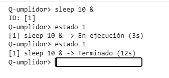
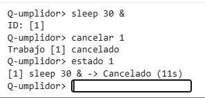

# Evidencia de verificación: versión 01 - Consultar estado y solicitar su cancelación

## 1. Identificación de la versión

| Campo | Valor |
|---|---|
| *Producto* | Consultar estado y solicitar su cancelación |
| *Versión* | Versión 01 (Avance 01) |
| *Commit evaluado* |  c99ad60, 4acabba, |
| *Fecha de la demostración* | 02/10/2026 |
| *Responsable de la ejecución* |  Marlene |
| *Revisor* | Ruy, Diego Misael |

## 2. Entorno de ejecución

| Campo | Valor |
|---|---|
| Sistema operativo | `Linux` |
| Versión de Python | `Python3`  |
| Comando de arranque | `python3 src/main.py` |

## 3. Alcance de la demostración

**Funcionalidades incluidas en esta versión:**
* Consulta del estado de un trabajo.
* Cancelación de trabajos.

**Funcionalidades no incluidas en esta versión:**
* Listado de trabajos.

  
### TC-001: Consulta de estado

| Campo | Contenido |
|---|---|
| **Objetivo** | Verificar que la consulta de estado devuelve el estado actual de un trabajo a partir de su identificador: en ejecución mientras el trabajo sigue activo y terminado una vez que concluye.  |
| **Precondiciones** | Consola iniciada; existe un trabajo enviado con `sleep N &` y se conoce su ID |
| **Pasos** | 1. Escribir `sleep [N] &`. 2. Obtención de ID. 3. Escribir `estado [ID]`. 4. Observar el resultado|
| **Resultado esperado** | Primera consulta: estado en ejecución. Segunda consulta: estado terminado. |
| **Resultado obtenido** | Tras enviar sleep 10 & (ID 1), la primera consulta mostró *en ejecución*. Después de 10 segundos, la segunda consulta mostró *terminado*. Coincide con lo esperado. |
| **Estado** |✅ Aprobado |

### TC-002: Solicitud de Cancelación

| Campo | Contenido |
|---|---|
| **Objetivo** | Solicitar la ejecución de un trabajo |
| **Precondiciones** | Consola iniciada; existe un trabajo enviado con `sleep N &` en ejecución |
| **Pasos** |  1. Escribir `sleep [N] &`. 2. Obtención de ID. 3. Escribir `cancelar [ID]`. 4. Observar el resultado |
| **Resultado esperado** | Cancelar la ejecución de un trabajo |
| **Resultado obtenido** | Se envió el comando `cancelar 1` y el programa cancelo la ejecución del trabajo y se comprobó con el comando estado `estado 1`   |
| **Estado** | ✅ Aprobado |

## 4. Resumen de resultados

| ID | Caso | Estado |
|---|---|---|
| TC-001 | `Consultar estado` | ✅ Aprobado |
| TC-002 | `Solicitud de cancelación` | ✅ Aprobado |

**Total:** 2️⃣ de 2️⃣ casos aprobados.

## 5. Defectos y limitaciones conocidos

| ID | Descripción | Caso relacionado | Estado |
|---|---|---|---|
| TC-001 |Sin defectos conocidos| - | - |
| TC-002 |Sin defectos conocidos| - | - |

## 6. Conclusión
En esta primer versión queda demostrado que la consola arranca de forma exitosa, permitiendo la consulta de estado de los trabajos y la solicitud de cancelación de los mismos. Sin defectos conocidos
