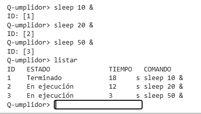

# Evidencia de verificación: versión 01 - Listar trabajos 

## 1. Identificación de la versión

| Campo | Valor |
|---|---|
| *Producto* | Listar los trabajos enviados |
| *Versión* | Versión 01 (Avance 01) |
| *Commit evaluado* | 66c4153|
| *Fecha de la demostración* | 02/10/2026 |
| *Responsable de la ejecución* | Ruy  |
| *Revisor* | Marlene, Diego Misael |

## 2. Entorno de ejecución

| Campo | Valor |
|---|---|
| Sistema operativo | `Linux` |
| Versión de Python | `Python3`  |
| Comando de arranque | `python3 src/main.py` |

## 3. Alcance de la demostración

**Funcionalidades incluidas en esta versión:**
* Listado de trabajos.

**Funcionalidades no incluidas en esta versión:**
* codigo de salida

### TC-001: Listar los trabajos 

| Campo | Contenido |
|---|---|
| **Objetivo** | Mostrar una lista con los trabajos enviados  |
| **Precondiciones** |  Consola iniciada; con trabajos activos |
| **Pasos** |  1. Escribir `sleep [N] &`. 2. Obtener ID.`3. Escribir `listar`. 4. Observar el resultado   |
| **Resultado esperado** | Enviar `listar` despues de haber enviado `sleep [N] &` y que se muestre una lista de los trabajos enviados.  |
| **Resultado obtenido** | Se envió `sleep [N] &` y el programa devolvió el ID [ID]. Al escribir listar, la consola mostró una lista con el trabajo [ID] aparece con estado. Coincide con lo esperado. |
| **Estado** |✅ Aprobado |

## 4. Resumen de resultados

| ID | Caso | Estado |
|---|---|---|
| TC-001 | Listar los trabajos | ✅ Aprobado |

**Total:** 1️⃣ de 1️⃣ casos aprobados.

## 5. Defectos y limitaciones conocidos

| ID | Descripción | Caso relacionado | Estado |
|---|---|---|---|
| TC-001 |Sin defectos conocidos| - | - |
| TC-002 |Sin defectos conocidos| - | - |
| TC-003 |Sin defectos conocidos| - | - |

## 6. Conclusión
En esta primer versión queda demostrado que la consola arranca de forma exitosa, permitiendo el listado de los trabajos y la liberación del promt de forma inmediata. 

