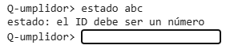

# Evidencia de verificación: versión 01 - Código de salida 

## 1. Identificación de la versión

| Campo | Valor |
|---|---|
| *Producto* | Código de salida  |
| *Versión* | Versión 01 (Avance 01) |
| *Commit evaluado* | 66c4153|
| *Fecha de la demostración* | 02/10/2026 |
| *Responsable de la ejecución* | Ruy  |
| *Revisor* | Marlene, Diego Misael |

## 2. Entorno de ejecución

| Campo | Valor |
|---|---|
| Sistema operativo | `Linux` |
| Versión de Python | `Python3`  |
| Comando de arranque | `python3 src/main.py` |

## 3. Alcance de la demostración

**Funcionalidades incluidas en esta versión:**
* codigo de salida

### TC-001: Comando sin ID 

| Campo | Contenido |
|---|---|
| **Objetivo** |	Verificar que el comando código <id>, que informa el código de salida de un trabajo ya enviado y muestra su uso  |
| **Precondiciones** |  Consola iniciada |
| **Pasos** |  1. Escribir codigo y presionar Enter.   |
| **Resultado esperado** |	La consola imprime exactamente: Uso: codigo <id>  |
| **Resultado obtenido** | Se envió un comando un comando incompleto y este reconoce que el comando ingresado se esta usando mal. Coincide con lo esperado. |
| **Estado** |✅ Aprobado |

### TC-002: ID que no es númerico 

| Campo | Contenido |
|---|---|
| **Objetivo** |		Verificar que un ID no numérico se rechaza con un mensaje claro  |
| **Precondiciones** |  Consola iniciada |
| **Pasos** |  	1. Escribir codigo abc y presionar Enter.   |
| **Resultado esperado** |La consola imprime exactamente: codigo: el ID debe ser un número |
| **Resultado obtenido** | Se envía el comando `estado abc` y la consola imprime: el ID debe ser un número |
| **Estado** |✅ Aprobado |

### TC-003: ID de un trabajo inexistente

| Campo | Contenido |
|---|---|
| **Objetivo** |Verificar que consultar un trabajo que no existe se informa correctamente |
| **Precondiciones** |Consola iniciada; no existe ningún trabajo con el ID 88|
| **Pasos** | 1. Escribir codigo 88 y presionar Enter. |
| **Resultado esperado** |La consola imprime exactamente: codigo: no existe el trabajo [88] |
| **Resultado obtenido** | Se envía el comando `estado 88` y la consola imprime: no existe el trabajo [88] |
| **Estado** |✅ Aprobado |

## 4. Resumen de resultados

| ID | Caso | Estado |
|---|---|---|
| TC-001 | Comando sin ID | ✅ Aprobado |
| TC-002 | ID que no es númerico | ✅ Aprobado |
| TC-003 | ID de un trabajo inexistente | ✅ Aprobado |

**Total:** 3️⃣ de 3️⃣ casos aprobados.

## 5. Defectos y limitaciones conocidos

| ID | Descripción | Caso relacionado | Estado |
|---|---|---|---|
| TC-001 |Sin defectos conocidos| - | - |
| TC-002 |Sin defectos conocidos| - | - |
| TC-003 |Sin defectos conocidos| - | - |

## 6. Conclusión
En esta primer versión queda demostrado que la consola responde correctamente ante comandos inválidos ya sea por falta de [ID], un ID no numérico o un trabajo que no existe. 

