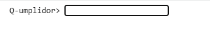
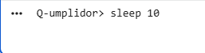
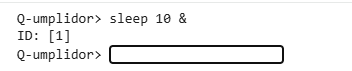

# Evidencia de verificación: versión demostrada de Q-umplidor

> Sustituye cada `[COMPLETAR]` con la información real. Borra las notas en cursiva antes de entregar.

## 1. Identificación de la versión

| Campo | Valor |
|---|---|
| Producto | Q-umplidor (JobRunner del equipo Qiskit Team) |
| Versión | [COMPLETAR] *(ejemplo: v0.1)* |
| Commit evaluado | [COMPLETAR] *(ejemplo: `a1b2c3d`)* |
| Fecha de la demostración | [COMPLETAR] *(DD/MM/AAAA)* |
| Responsable de la ejecución | [COMPLETAR] |
| Revisor | [COMPLETAR] |

## 2. Entorno de ejecución

| Campo | Valor |
|---|---|
| Sistema operativo | [COMPLETAR] *(ejemplo: Ubuntu 24.04)* |
| Versión de Python | [COMPLETAR] *(salida de `python3 --version`)* |
| Comando de arranque | `python3 src/main.py` |

## 3. Alcance de la demostración

**Funcionalidades incluidas en esta versión:**

- [COMPLETAR] *(ejemplo: ejecución de `sleep N`)*
- [COMPLETAR] *(ejemplo: ejecución en segundo plano con `sleep N &` y asignación de ID)*

**Funcionalidades no incluidas en esta versión:**

- [COMPLETAR] *(ejemplo: acceso remoto por LAN/VPN, persistencia)*

## 4. Casos ejecutados

*Un caso por funcionalidad. El resultado esperado se escribe antes de ejecutar; el obtenido, después. Cada captura se guarda en `img/` con el ID del caso.*

### TC-001: Arranque de la consola

| Campo | Contenido |
|---|---|
| **Objetivo** | Verificar que el programa inicia y muestra el prompt `Q-umplidor>` |
| **Precondiciones** | Python instalado; terminal abierta en la raíz del repositorio |
| **Pasos** | 1. Ejecutar `python3 src/main.py`. |
| **Resultado esperado** | [COMPLETAR] |
| **Resultado obtenido** | [COMPLETAR] |
| **Estado** | Aprobado / Fallido |

### TC-002: Ejecución de `sleep N` en primer plano

| Campo | Contenido |
|---|---|
| **Objetivo** | Verificar que `sleep N` ocupa la consola durante N segundos y luego devuelve el prompt |
| **Precondiciones** | Consola iniciada |
| **Pasos** | 1. Escribir `sleep [N]`. 2. Esperar a que termine. |
| **Resultado esperado** | [COMPLETAR] |
| **Resultado obtenido** | [COMPLETAR] |
| **Estado** | Aprobado / Fallido |

### TC-003: Ejecución de `sleep N &` en segundo plano

| Campo | Contenido |
|---|---|
| **Objetivo** | Verificar que `sleep N &` crea un trabajo en segundo plano, devuelve un ID y libera el prompt de inmediato |
| **Precondiciones** | Consola iniciada; sin trabajos activos |
| **Pasos** | 1. Escribir `sleep [N] &`. 2. Observar la respuesta. |
| **Resultado esperado** | [COMPLETAR] |
| **Resultado obtenido** | [COMPLETAR] |
| **Estado** | Aprobado / Fallido |

### TC-00X: [Nombre del caso]

*Copia este bloque para cada caso adicional (consultar estado, listar trabajos, cancelar, entrada inválida, etc.).*

| Campo | Contenido |
|---|---|
| **Objetivo** | [COMPLETAR] |
| **Precondiciones** | [COMPLETAR] |
| **Pasos** | [COMPLETAR] |
| **Resultado esperado** | [COMPLETAR] |
| **Resultado obtenido** | [COMPLETAR] |
| **Estado** | Aprobado / Fallido |

## 5. Resumen de resultados

| ID | Caso | Estado |
|---|---|---|
| TC-001 | Arranque de la consola | [COMPLETAR] |
| TC-002 | `sleep N` en primer plano | [COMPLETAR] |
| TC-003 | `sleep N &` en segundo plano | [COMPLETAR] |
| TC-00X | [COMPLETAR] | [COMPLETAR] |

**Total:** [COMPLETAR] de [COMPLETAR] casos aprobados.

## 6. Defectos y limitaciones conocidos

| ID | Descripción | Caso relacionado | Estado |
|---|---|---|---|
| [COMPLETAR] | [COMPLETAR] | [COMPLETAR] | [COMPLETAR] |

*Si no hay defectos conocidos, escribe: "No se identificaron defectos durante esta demostración."*

## 7. Conclusión

[COMPLETAR] *(2 o 3 líneas: qué se logró demostrar con esta versión, qué queda pendiente y cuál es el siguiente paso.)*
